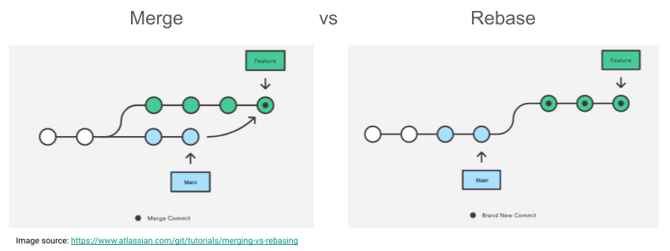

## Branching
We mentioned the term 'branch' a few times in the previous lessons, but didn't describe what branches are.
In git terminology a *branch* is one of the (possibly many) end points on a path that is describe by the commits of your repository.
Until now our repository has been a linear chain of commits, where each commit builds on the previous one like this:

Note that in the above we represent commits as circles (read left to right), and the "Main" branch of our repository is just a pointer to a given commit along this chian.

However, at any point in our history, we can have two commits, that are both related to the same parent, essentially making a fork or "branch" in our chain of commits.
This means that we can have multiple end points to our chain of commits.
Why would we want to do this?
A common reason is related to the following diagram:

In the branching example above we have three different end points to our chain labelled "Little Feature", "Main", and "Big Feature".
As the name suggests each branch serves a particular purpose.
When you want to add a new feature or fix a bug you create a new branch to encapsulate your changes.
Having multiple branches, and being able to swap between them, means that you can effectively have multiple version of your code in development at once.
This might sound scary but you can for example have a main branch that is "always working", and a development branch that "should work", and feature branches that are "not working yet".
The thing that makes branches so useful is that you can merge branches onto each other.
So when your feature works, you can copy all the commits onto the development branch at once.
This is called merging, and it's really powerful, but has a risk of causing conflicts.

> ## Create a branch
> In our skysim repository create a new branch called 'feature-1' as follows:
> ~~~
> git branch feature-1
> git checkout feature-1
> ~~~
> {: .language-bash}
> 
> Within this branch add a new function to your `sky_sim.py` called `clip_to_radius` which is a placeholder for future development.
>
> Commit these changes to the `feature-1` branch.
>
> Use `git checkout` to swap between your two branches and view the history (`git log`) and content of the `sky_sim.py` file for each branch.
>
> When you are happy with the changes push your new branch to github.
>
> Checkout your main branch before moving on.
{: .challenge}

> ## Merge your branch back into main
> Checkout your `main` branch.
>
> Merge changes from your `feature-1` branch using:
> ~~~
> git merge feature-1
> ~~~
> {: .language-bash}
>
> You will (hopefully) get a message showing the files which were changed during the merge.
> If there are no conflicts then git will just add the commits from the `feature-1` branch to your main branch.
> We'll explore the case of conflicts in a latter lesson.
>
> Confirm that you have commits to push using `git status` and then push these to github.
>
> Now that you have all your changes on GitHub you don't need your local feature branch so you can delete it with:
> ~~~
> git branch -D feature-1
> ~~~
> {: .language-bash}
>
> Head to GitHub and check that all your changes have been included on the main branch.
{: .challenge}

In the next lesson we'll explore how we can incorporate branches into our workflow.

## Consolidating Changes

**Merging vs Rebasing**

In essence, both `git merge` and `git rebase` achieve the same thing, that is integrating changes from one branch into another branch.
However, how this is done differs:
1. `git merge` creates a new commit that integrates the changes from branch a (e.g. `main`) into branch b (e.g. `feature`). The existing branches are not changed in any way.

2. `git rebase` moves the entire branch b (ie `feature`) to the tip of branch a (ie `main`), effectively incorporating all changes from branch a and leaving you with a linear history. Rebasing **rewrites** your project history!

The image below visualizes the difference between `git merge` and `git rebase`.
We will look at using both, but to read a good comparison visit the [Atlassian Merging vs. Rebasing page](https://www.atlassian.com/git/tutorials/merging-vs-rebasing).

### Rebase 

With GitLab you can:
1. rebase from the command line, automatically or interactively, or
2. rebase from the UI

> ## Remember: Rebasing rewrites your history
> You should not rebase a shared branch as this can lead to complex merge issues.
{: .callout}